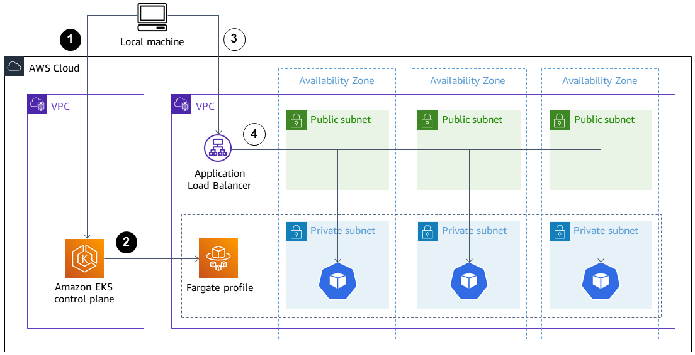

# Deploy and debug Amazon EKS-Cluster


# Resumen

Es un ambiente POC - Pilot creado por la documentación oficial de AWS. Se estará creando un cluster de EKS con el servicio AWS Fargate dentro de la implementación se creará un AWSLoadBalancerController y luego se usara el comando `kubectl port-forward`

## Herramientas
+ Amazon Elastic Kubernetes Service (Amazon EKS)
+ AWS Fargate
+ Elastic Load Balancing (ELB)
+ Helm v3
+ eksctl (última versión)
+ CLI de AWS

<details>
<summary>Crear un clúster de EKS</summary> 

#### 1.- Configure las variables de entorno.


```
export AWS_REGION="us-east-1"
export CLUSTER_NAME="my-fargate"
```

#### 2.- Crear un clúster de EKS.

Para crear un clúster de EKS se utilizara  las especificaciones del archivo clusterconfig-fargate.yaml, ejecute el siguiente comando.

`eksctl create cluster -f clusterconfig-fargate.yaml`


El clusterconfig-farget arroja un Stack en cloudformation:


#### 3.- Compruebe el clúster creado.

3.1.- Vamos a comprobar que el cluster se creo correctamente

`eksctl get cluster --output yaml`

La salida debería verse de la siguiente manera:
```
- Name: my-fargate
  Owned: "True"
  Region: us-east-1
```
3.2.- Compruebe el perfil de Fargate creado utilizando el CLUSTER_NAME.

`eksctl get fargateprofile --cluster $CLUSTER_NAME --output yaml`

3.3.- Este comando muestra información sobre los recursos. Puede usar la información para verificar el clúster creado. La salida debería ser la siguiente.
```
- name: fp-default
  podExecutionRoleARN: arn:aws:iam::<YOUR-ACCOUNT-ID>:role/eksctl-my-fargate-cluster-FargatePodExecutionRole-xxx
  selectors:
  - namespace: default
  - namespace: kube-system
  status: ACTIVE
  subnets:
  - subnet-aaa
  - subnet-bbb
  - subnet-ccc
```
#### 

</details>

<details>
<summary>Implementar un controlador del ELB</summary>  

</details>

<details>
<summary>Depurar contenedores en ejecución (port-forward)</summary>  

</details>

<details>
<summary>Eliminar recursos</summary>  

</details>

<details>
<summary>Solución de problemas</summary>  

</details>

